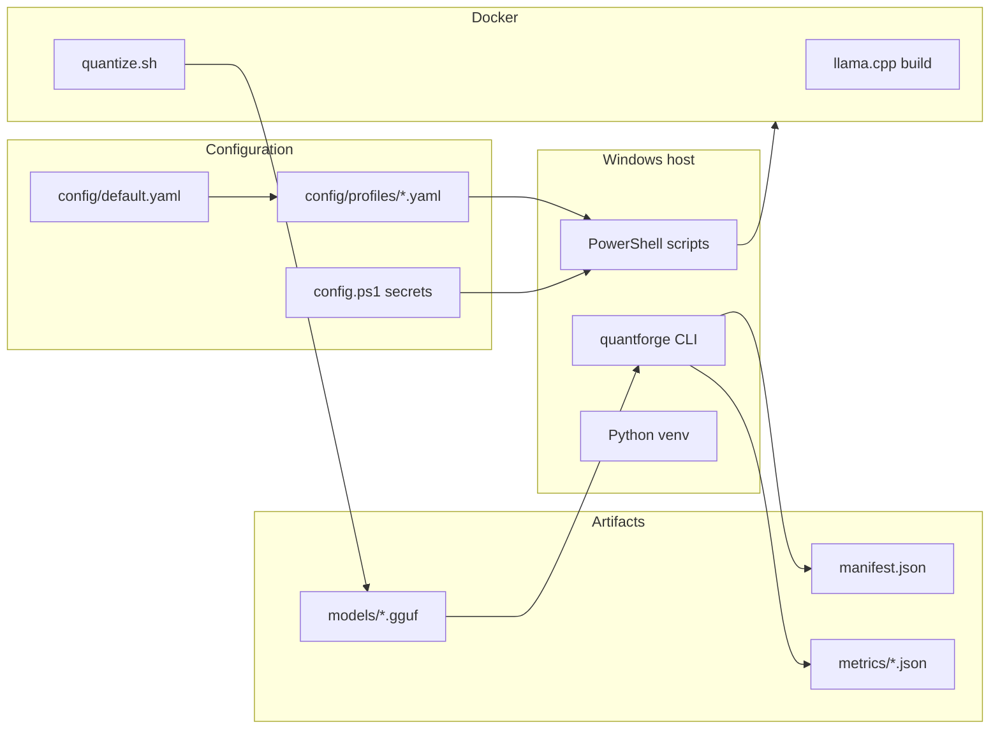

# QuantForge Architecture

> Full process description with diagrams: [ARTICLE.md](../ARTICLE.md)

## Overview

QuantForge automates the path from HuggingFace weights to a local **GGUF** file, validation, benchmarking, and IDE integration on **Windows**.

## Pipeline stages

| Step | Component | Output |
|------|-----------|--------|
| 1 | Docker check | — |
| 2 | `Dockerfile` multi-stage build | `llama-quantizer:latest` |
| 3 | `scripts/quantize.sh` | FP16 GGUF → Q5_K_M GGUF |
| 4 | `quantforge validate` | `models/manifest.json` |
| 5 | `quantforge benchmark` | `metrics/benchmark_results.json` |
| 6 | `quantforge report` | `metrics/report.md` |

## Configuration flow

1. `config/default.yaml` — base paths, validation, API, Ollama defaults.
2. `config/profiles/<name>.yaml` — model repo, GGUF name, quant type.
3. `scripts/Load-Config.ps1` → exports env vars for PowerShell and Docker.
4. `quantforge.config` — same YAML for Python CLI.

Profile selection: `$env:QUANTFORGE_PROFILE` or `-p` on CLI.

## Python package (`src/quantforge/`)

| Module | Role |
|--------|------|
| `config.py` | YAML load/merge |
| `validate_runner.py` | GGUF size + smoke test |
| `benchmark_runner.py` | CPU/GPU benchmark |
| `metrics_store.py` | JSON + JSONL history |
| `report_runner.py` | Markdown reports |
| `serve_runner.py` | OpenAI API for IDEs |
| `clean_runner.py` | Disk cleanup |
| `inference.py` | ChatML helpers |
| `cli.py` | Entry point |

## IDE integration

Two supported paths:

1. **Ollama** — `ollama/Modelfile` + `setup_ollama.ps1` → Void uses `qwen2.5-coder-q5`.
2. **OpenAI API** — `quantforge serve` / Docker Compose → base URL `http://127.0.0.1:8000/v1`.

Both require **ChatML**; raw GGUF paths in IDEs cause `<|im_start|>` loops.

## Reliability (P4)

| Mechanism | Purpose |
|-----------|---------|
| `logs/.pipeline.lock` | Prevent concurrent pipeline runs |
| `FORCE_QUANTIZE=1` | Re-run Docker quantize even if GGUF exists |
| `SKIP_DOCKER_BUILD=1` | Reuse existing image |
| `SKIP_BENCHMARK=1` | Skip step 7 |
| `KEEP_BASE=0` | Delete HF weights after quant (in `quantize.sh`) |

## CI

GitHub Actions: ruff, pytest, config smoke, Docker build verify.

See [troubleshooting.md](troubleshooting.md) for common failures.
